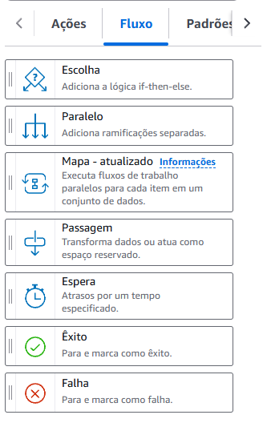
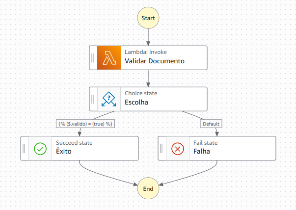

# Conceito
O AWS Step Function é um serviço gerenciado pela AWS para a **orquestração de componentes de aplicativos**, como funções Lambda, microsserviços, AWS S3 e outros serviços da AWS, através de um **console gráfico** que permite criar, gerenciar e executar **fluxos de trabalho (workflows)** complexos.
## Como Funciona?
Você cria uma **máquina de estados** (_state machine_), onde cada **estado** representa uma etapa do processo (por exemplo, chamar uma função Lambda, esperar um tempo, fazer uma escolha condicional, rodar em paralelo etc.).
### Tipos de Workflows
- **Standard Workflows**
	- **Duração:** Pode durar até um ano, sendo ideal para processos de longa duração.
	- **Execução:** Oferece execução "exatamente uma vez", garantindo que cada etapa seja executada apenas uma vez
- **Express Workflows**
	- **Duração:** Duração máxima de 5 minutos, sendo ideal para fluxos de trabalho de curta duração.
	-  Ideal para processamento de eventos de alto volume, como análise de dados em tempo real e processamento de lotes.
### Tipos de Estados
1. **Task**
	- Executa um serviço (chama uma Lambda, envia mensagem pro SQS, ...)
2. **Choice**
	Direciona o fluxo para diferentes estados dependendo do input, utilizando desvios condicionais if/else
3. **Wait**
	- Introduz uma pausa no fluxo durante um tempo específico
4. **Succed**
	- Finaliza a execução do fluxo de trabalho como um sucesso.
5. **Fail**
	- Finaliza a execução do fluxo de trabalho como um erro, você pode definir uma mensagem de erro.
6. **Parallel**
    - Executa vários estados em paralelo, para que diferentes ações possam ocorrer simultaneamente, todos precisam terminar para seguir adiante.
7. **Map**
	- Itera sobre uma lista (tipo um **for loop**), executando os mesmos estados para cada item.

# Exemplo

Neste exemplo temos um fluxo simples de validação de documentos:
- **Lambda**: armazena a função que fará a validação 
- **Estado Choice**: serparará o fluxo em dois caminhos de acordo com o valor da variável "valido" (true ou false)
	- se true: mostrará como **Succeed**
	- se false: mostrará como **Fail** e aperecerá uma mensagem de erro como "Documento Inválido"